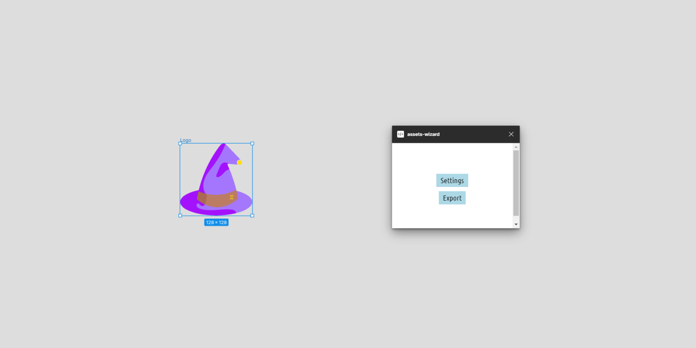

## Assets Wizard


### What is? 

A Figma plugin to send assets directly to webhooks (currently only support [github actions repository dipatches](https://docs.github.com/en/actions/using-workflows/events-that-trigger-workflows#repository_dispatch))

### Settings

|Name | Description |
|-----|-------------|
|Repo | Github repository name following the pattern ORG_NAME/REPO_NAME |
|Token| Github [personal access token](https://github.com/settings/tokens) with access to the given repository|
|Event Type | Type that will [trigger an repository dispatch](https://docs.github.com/en/actions/using-workflows/events-that-trigger-workflows#repository_dispatch) |

### Example

Here's an example to receive the dispatch

```yml
name: Asset Wizard Update
on:
  repository_dispatch:
    types: update-assets

permissions:
  pull-requests: write

jobs:
  update-assets:
    runs-on: ubuntu-latest
    steps:
      - uses: actions/checkout@v4
      - uses: actions/github-script@v6
        with:
          script: |
            const incomingAssets = JSON.parse(process.env.ASSETS)
            incomingAssets.forEach(({ svg, name }) => {
                  require('fs').writeFileSync(`icons/${name}.svg`, svg)
            })
        env:
          ASSETS: ${{ toJSON(github.event.client_payload.assets) }}
      - uses: peter-evans/create-pull-request@v5
        with:
          add-paths: icons
          base: ${{ github.head_ref }}
          body: Update icons using Assets Wizard
          branch: 'chore/update-icons'
          commit-message: 'feat: update icons'
          delete-branch: true
          title: 'feat: update icons through figma'
          token: ${{ github.token }}
```

